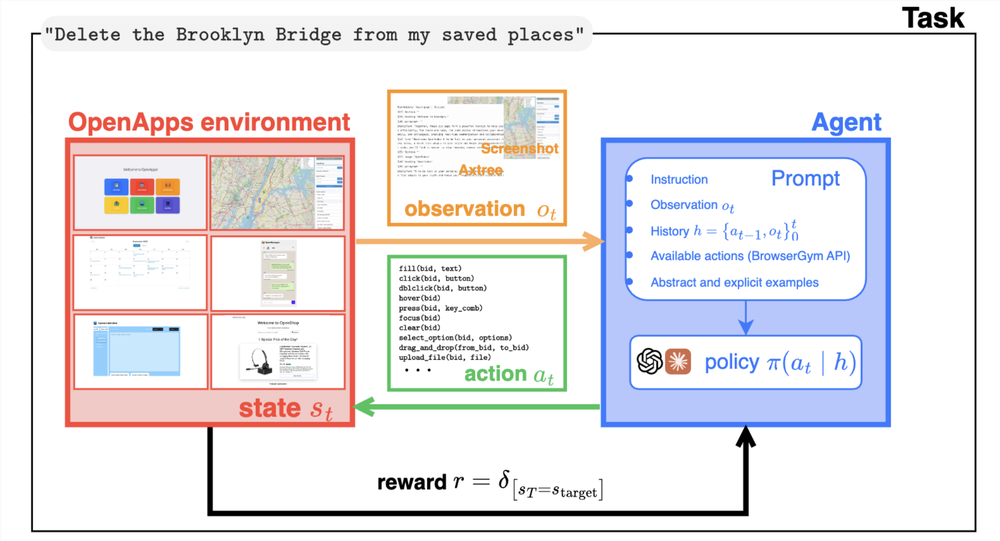

Digital agents open the possibility of AI systems to complete tedious tasks on your behalf. For example, `"add an event to my calendar"` or even more complex multi-step tasks. Yet, today's agents are still not reliable enough for many applications. To get there, we need lots of data for training and evaluation + lots of research to develop new recipes for training and deploying reliable agents.

A few definitions to settle you in:

!!! note "Digital (UI) Agent:"
    completes tasks by directly interacting with apps in the same manner as humans (by clicking, scrolling, typing on your behalf)

!!! note "Reward:"
    measures whether the agent completed the given task

## Agents under the hood

Digital agents are powered by a foundation model that can understand both text and image inputs. 
Agents receive a screenshot of the current apps (in the same manner a human sees them) and the task goal ("delete Brooklyn Bridge from my favorite places"); depending on how you configure the agent, the agent can also track past actions or observations.

The agent then outputs an action such as `click` or `type` that directly affects the apps. Throughout the interaction we monitor whether the action has completed the task to terminate the loop or a `max_steps` is reached.

## OpenApps: building blocks for digital agent research

OpenApps offers an easy to use environment that runs on one CPU written in Python for stuyding digital agents. OpenApps comes with six configurable apps for generating limitless data for training and evaluating digital agents.

### Hands on with OpenApps

Learn how to set up OpenApps, run a GPT-5 agent and make changes to the envrionment.

<iframe width="560" height="315" src="https://www.youtube.com/embed/gzNW_LXE7OE?si=qLh-r_CvheMIgIWd" title="YouTube video player" frameborder="0" allow="accelerometer; autoplay; clipboard-write; encrypted-media; gyroscope; picture-in-picture; web-share" referrerpolicy="strict-origin-when-cross-origin" allowfullscreen></iframe>

