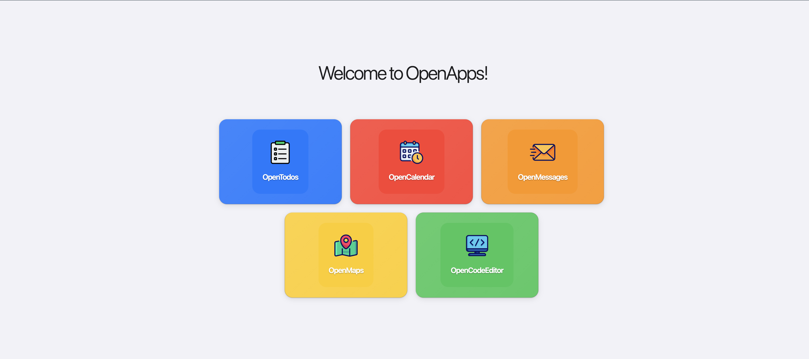
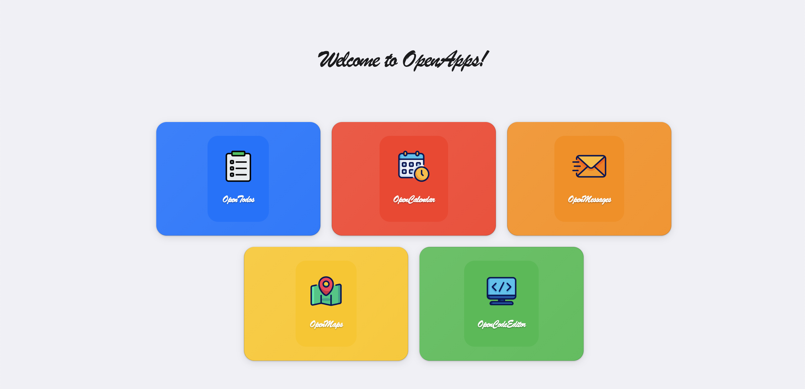
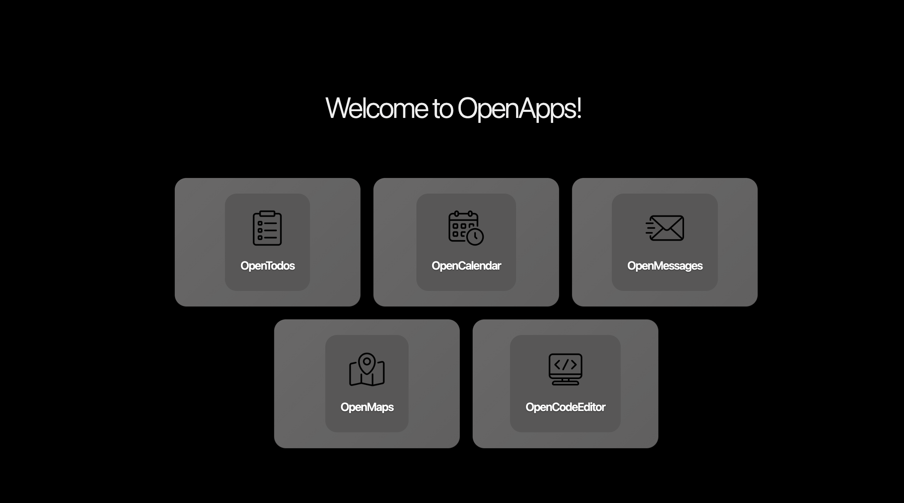
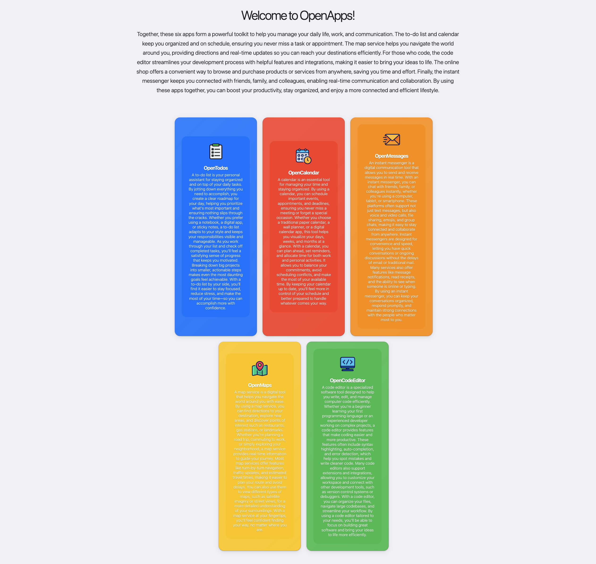

title: Start with OpenApps

> Building Blocks for Digital Agents Research

New to agents? See our [Intro to UI Agents](Intro to UI Agents.md). We take you through the installation and running your first agent step-by-step.

Why OpenApps? Evaluate and train multimodal agents to use apps like humans do (by clicking, typing, and scrolling):

✅ **Unlimited data** (for evaluating and training UI-agents): Configurable state and design to generate thousands of versions of each app

✅ **Lightweight**: runs on a single CPU (and Python-based); no Docker or OS emulators needed

✅ **Ground truth rewards**: task rewards are based on the underlying state and all app logic is transparent in Python

### Install

Install the conda alternative [uv](https://docs.astral.sh/uv/getting-started/) and clone the repo:

```bash
   git clone https://github.com/facebookresearch/OpenApps.git
```

Install dependencies:   

```bash
   uv sync
```

For other installation options and online shop setup see [Installation](installation.md).

### Run OpenApps

```bash
uv run launch.py 
```


For an overview, checkout our [video tutorial](https://www.youtube.com/watch?v=gzNW_LXE7OE).

### App variations
Each app can be modified with variables available in `config/apps`. You can override any of these via command line:

```bash
uv run launch.py 'apps.todo.init_todos=[["Call Mom", false]]'
```

OpenApps also comes with pre-defined variations that can affect the content and appearance of apps.

#### Appearance

/// tab | challenging font

    ::bash
    export APPEARANCE=challenging_font



///
/// tab | dark theme

    ::bash
    export APPEARANCE=dark_theme


///
/// tab | default

    ::bash
    export APPEARANCE=default


///

Launch specific apps with selected appearance:
```shell
uv run launch.py apps/start_page/appearance=$APPEARANCE
```

Or specific apps with: `apps/calendar/appearance=$APPEARANCE`.

#### Content

/// tab | german

    ::bash
    export CONTENT=german


///
/// tab | long_descriptions

    ::bash
    export CONTENT=long_descriptions


///
/// tab | pop-up

    ::bash
    uv run launch.py apps/pop_ups=adversarial_descriptions


///

```shell
uv run launch.py apps/start_page/content=$CONTENT
```

Or specific apps with: `apps/calendar/content=$CONTENT`.

You can see the specific variables for each defined in the individual apps. For example, `config/apps/maps/appearance/dark_theme.yaml`.

## Launch Agent

For agents to directly interact with apps, install: `playwright install chromium`.


Launch an agent to perform a task of *adding a meeting with Dennis to the calendar*:

/// tab | Random Click Agent

    ::bash
    uv run launch_agent.py agent=dummy task_name=add_meeting_with_dennis
///
/// tab | GPT-5.1 Agent

    ::bash
    # export OPENAI_API_KEY=""
    uv run launch_agent.py agent=GPT-5-1 task_name=add_meeting_with_dennis
///

You can specify the agent of your choice with the `agent=` argument. For example `agent=dummy` is a simple agent that clicks randomly on any buttons, great for exploration!

Learn more about launching with OpenAI, Claude, VLLM models, or specialized models such as UI-Tars in [agents guide](agents.md) and available tasks in our [task guide](tasks.md).

!!! info "Note:"
    To test the ability of a model to navigate the UI without simplified HTML, set: `agent.use_axtree=False`

To see the agent solving the task live:
```
uv run launch_agent.py browsergym_env_args.headless=False
```


### Logs

By default, information about the number of steps an agent took, task success, etc. will be shown in the terminal:

```
...
Experiment results
exp_dir: /Users/m...
n_steps: 10
cum_reward: 0.0
stats.cum_agent_elapsed: 0.0017838478088378906
stats.max_agent_elapsed: 0.0002570152282714844
...
```

All logs are stored `log_outputs` will contain information about each run


You can also enable logging to weights and biases by logging into your account and setting the flag: `use_wandb=True`.


## Launch Agent(s) Across Multiple Tasks
> launch thousands of app variations to study agent behaviors in parallel

!!! info "Note:"
    Parallel launching works with SLURM. Be sure to update configs in `config/mode/slurm_cluster.yaml`.

You can launch one (or multiple) agents to solve many tasks in parallel, each in an isolated deployment of OpenApps, using SLURM:

```
uv run launch_parallel_agents.py mode=slurm_cluster agent=dummy use_wandb=True
```

This launches random click agents to solve each task across each app variation in parallel as defined in `config_parallel_tasks.yaml`

```yaml
parallel_tasks:
  _target_: open_apps.tasks.parallel_tasks.AppVariationParallelTasksConfig
  task_names:
    - add_meeting_with_dennis
    - add_call_mom_to_my_todo
    - save_paris_to_my_favorite_places
  app_variations:
    - ["apps/start_page/content=default", "apps/calendar/content=german"]
    - [
        "apps/start_page/appearance=dark_theme",
        "apps/calendar/appearance=dark_theme",
      ]
```

You can modify the set of tasks or app variation by updating the `config_parallel_tasks.yaml`. We ensure:

* Each deployment of OpenApps can have different appearance and content per app.
* Each task is launched in an isolated environment for reproducible results.


## Testing

Run all tests via:

```python
uv run -m pytest tests/
```

## Attribution

Our apps are built on top of several excellent frameworks:  

- FastHTML [framework](https://github.com/AnswerDotAI/fasthtml) and [examples](https://github.com/AnswerDotAI/fasthtml-example) which allowed us to build fully functional apps in Python, the language most familiar to AI researchers.
- [Browser Gym](https://github.com/ServiceNow/BrowserGym/blob/main/LICENSE) and [AgentLab](https://github.com/ServiceNow/AgentLab/blob/main/LICENSE):
- [Spacy](https://github.com/innoq/spacy/blob/main/LICENSE): for natural language processing
- [Open Street Maps](https://www.openstreetmap.org/copyright): for our Maps apps.
- (and for the optional webshop) we rely on [WebShop](https://github.com/princeton-nlp/WebShop/blob/master/LICENSE.md) developed by Princeton University

Some icons are have been designed using resources from Flaticon.com


Our work is licensed under CC-BY-NC, please refer to the [LICENSE](https://github.com/facebookresearch/OpenApps/blob/main/LICENSE) file in the top level directory.
Copyright © Meta Platforms, Inc. See the [Terms of Use](https://opensource.fb.com/legal/terms/) and [Privacy Policy](https://opensource.fb.com/legal/privacy/) for this project.
